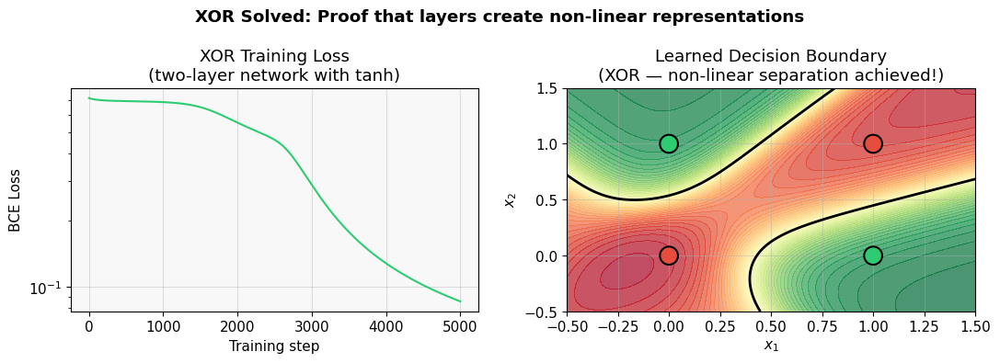

# AI Deep Learning Foundations — From Scratch to Advanced

A self-paced, notebook-based curriculum that builds deep learning intuition from the ground up. Each notebook is a standalone lesson: you run it, experiment with the code, and read the inline explanations before moving to the next.

---

## Why This Exists

Most deep learning tutorials jump straight to PyTorch and pretend math doesn't matter. Most math courses never show you why any of it is useful. This project closes that gap.

Starting from the definition of a function, the notebooks walk all the way to multi-layer neural networks — explaining *why* derivatives power gradient descent, *why* vectors and matrices are the native language of neural networks, and *why* stacking layers breaks linear constraints.

---

## Project Progression

| Phase | Topic | Notebooks |
|-------|-------|-----------|
| **1 — Math Foundations** | Functions, calculus, linear algebra | `0. math`, `1. derivatives`, `2. vectors`, `3. gradient`, `4. matrix` |
| **2 — PyTorch Tensors** | The workhorse data structure of deep learning | `tensors_1` → `tensors_5` |
| **3 — Neural Networks** | Single neurons, layers, and multi-layer math | `neural_network/` |

---

## Notebook Reference

### Phase 1 — Mathematical Foundations

#### `0. math.ipynb`
Plots and experiments with the core function families used throughout deep learning:
linear, quadratic, cubic, exponential, trigonometric, and composite functions.
Builds the intuition that a neural network is just a composition of many such functions.

#### `1. derivatives.ipynb`
Introduces calculus from the ground up — what a derivative is, how to compute it,
and how to visualize the tangent line at any point on a curve.
The punchline: a derivative tells you which direction makes a function grow,
so running it backwards (gradient descent) makes it shrink — the core of all training.

#### `2. vectors.ipynb`
Covers vector operations hands-on: addition, scalar multiplication, magnitude,
dot product, and subtraction. Motivates why a neuron's inputs are a vector
and why the dot product with a weight vector is "how aligned are these two directions?"

#### `3. gradient.ipynb`
Extends derivatives to multiple dimensions. Plots gradient vectors over contour
maps and shows steepest ascent/descent. Directly connects to backpropagation:
the gradient of the loss surface tells the optimizer which direction to step.

#### `4. matrix.ipynb`
Matrix fundamentals and operations. Establishes that every neural network layer
is a matrix multiplication — a learned linear transformation of its input space.

---

### Phase 2 — PyTorch Tensors

Tensors are the generalization of scalars → vectors → matrices to arbitrary dimensions.
Every image, sentence, and audio clip a neural network sees arrives as a tensor.

#### `tensors_1.ipynb`
Tensor creation, initialization strategies, data types, matrix multiplication,
batch operations, element-wise ops, transposing, and permuting axes.

#### `tensor_2_flatten-squeeze.ipynb`
Shape manipulation: flatten, reshape, view, squeeze, and unsqueeze.
Critical for connecting convolutional layers to fully-connected layers.

#### `tensoe_3_indexing&slicing.ipynb`
Advanced indexing, slicing, boolean masking, and conditional value modification.
The skills needed to select data subsets during training loops.

#### `tensor_4_Cat_stack_concat.ipynb`
Concatenation along existing dimensions (`cat`) vs. adding a new dimension (`stack`).
Needed for building batch inputs and combining feature representations.

#### `tensors_5_Special-Tensors_eye,rand,arange,linspace.ipynb`
Special tensor factories: identity matrices, random tensors, integer sequences,
and linearly spaced values. Used constantly in weight initialization and data generation.

---

### Phase 3 — Neural Networks

#### `neural_network/single_neuron.ipynb`
Dissects a single artificial neuron: weights, bias, weighted sum, and activation
functions (sigmoid, ReLU, tanh, linear). Shows that a neuron is just a dot product
followed by a non-linear squash — nothing more.

#### `neural_network/neuron_layers.ipynb`
Models a full layer as a linear transformation of its input space. Covers activation
functions in depth and explains why non-linearity is essential — without it,
stacking layers collapses to a single matrix multiplication.

#### `neural_network/2_multi_neuron_layers_&_math.ipynb`
The most advanced notebook. Topics include:
- Hyperplane arrangements and how layers carve feature space
- Information theory perspective on representation learning
- Weight initialization strategies (Xavier, He)
- Backpropagation derivation step-by-step
- Batch normalization and its effect on gradient flow
- Low-Rank Adaptation (LoRA) as an efficient fine-tuning method
- Neural Tangent Kernel — why wide networks behave like kernel machines
- Applications to NLP (Transformers, embeddings) and CV (CNNs, CAM)

---

## Output Visualization



The `output.png` demonstrates the canonical proof that multiple layers enable
non-linear learning:

- **Left panel** — Training loss falling over 5 000 steps as the network learns the XOR function.
- **Right panel** — Learned decision boundary: the red/green regions correctly separate all four
  XOR input combinations, something a single linear layer provably cannot do.

This plot is the "hello world" of deep learning theory — once you can read it,
you understand why depth matters.

---

## Tech Stack

| Tool | Role |
|------|------|
| **Python 3.x** | All code |
| **Jupyter Notebooks** | Interactive, narrative learning format |
| **NumPy** | Numerical computing, array math |
| **PyTorch** | Tensor operations and neural network layers |
| **Matplotlib** | Visualizations, plots, contour maps |

---

## How to Run

```bash
# 1. Install dependencies
pip install numpy torch matplotlib jupyter

# 2. Launch Jupyter
jupyter notebook

# 3. Work through notebooks in order:
#    0. math  →  1. derivatives  →  2. vectors  →  3. gradient  →  4. matrix
#    tensors_1  →  ...  →  tensors_5
#    neural_network/single_neuron  →  neuron_layers  →  2_multi_neuron_layers_&_math
```

Each notebook is self-contained — all imports and setup are at the top.

---

## Who This Is For

- Students moving from mathematics or statistics into machine learning
- Self-learners who want to understand what is happening *inside* PyTorch
- Anyone who has used deep learning tools but never felt confident about the math
